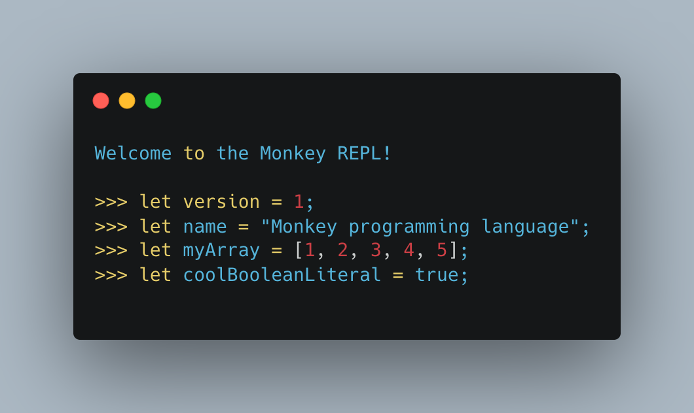

# Monkey RS
[](#license)

## What's Monkey?


> The official Monkey logo

`Monkey` is a programming language designed to learn interpreters.

It's came from Thorsten Ball's excellent book [Writing An Interpreter in Go](https://interpreterbook.com/).

### Monkey Language

Monkey looks like this:

```javascript
// Bind values to names with let-statements
let version = 1;
let name = "Monkey programming language";
let myArray = [1, 2, 3, 4, 5];
let coolBooleanLiteral = true;

// Use expressions to produce values
let awesomeValue = (10 / 2) * 5 + 30;
let arrayWithValues = [1 + 1, 2 * 2, 3];
```

Monkey supports builtin data structures: booleans, strings, hashes, integers and arrays.

```javascript
// Here is an array containing two hashes, that use strings as keys and integers
// and strings as values
let people = [{"name": "Anna", "age": 24}, {"name": "Bob", "age": 99}];

// Getting elements out of the data types is also supported.
// Here is how we can access array elements by using index expressions:
fibonacci(myArray[4]);
// => 5

// We can also access hash elements with index expressions:
let getName = fn(person) { person["name"]; };

// And here we access array elements and call a function with the element as
// argument:
getName(people[0]); // => "Anna"
getName(people[1]); // => "Bob"
```

In monkey, functions are first-class citizens.

```javascript
// Define the higher-order function `map`, that calls the given function `f`
// on each element in `arr` and returns an array of the produced values.
let map = fn(arr, f) {
  let iter = fn(arr, accumulated) {
    if (len(arr) == 0) {
      accumulated
    } else {
      iter(rest(arr), push(accumulated, f(first(arr))));
    }
  };

  iter(arr, []);
};

// Now let's take the `people` array and the `getName` function from above and
// use them with `map`.
map(people, getName); // => ["Anna", "Bob"]
```

And, of course, Monkey also supports closures:

```javascript
// newGreeter returns a new function, that greets a `name` with the given
// `greeting`.
let newGreeter = fn(greeting) {
  // `puts` is a built-in function we add to the interpreter
  return fn(name) { puts(greeting + " " + name); }
};

// `hello` is a greeter function that says "Hello"
let hello = newGreeter("Hello");

// Calling it outputs the greeting:
hello("dear, future Reader!"); // => Hello dear, future Reader!
```

So, to summarize: Monkey has a C-like syntax, supports **variable bindings**, **prefix** and **infix** operators, has **first-class and higher-order functions**, can handle **closures** with ease and has **integers, booleans, arrays** and **hashes** built-in.


## How to Use

### with REPL



```bash
$ git clone https://github.com/ijingo/monkey-rs
$ cargo run
```

### Language Syntax Reference

Please refer to [Writing An Interpreter in Go](https://interpreterbook.com/).

A non official document [link](docs/monkey.md).

## License
Licensed under the [MIT license](LICENSE).
